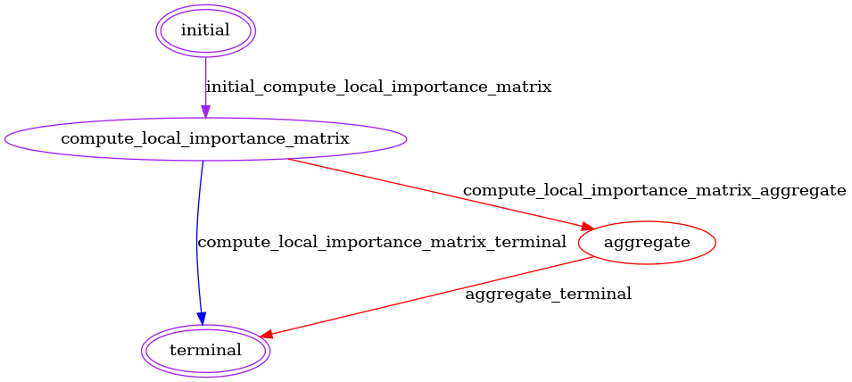

# Federated GENIE3 for FeatureCloud

A privacy-preserving implementation of GENIE3 (GEne Network Inference with Ensemble of trees) for the [FeatureCloud](https://featurecloud.ai/) platform. This package enables federated gene regulatory network (GRN) inference across multiple data sites without sharing raw data.

## Overview

Federated GENIE3 allows multiple institutions to collaboratively infer gene regulatory networks while keeping their data private and secure. Each participating site:

1. Computes local feature importance matrices using their own gene expression data
2. Shares only aggregated importance scores (not raw data) with a coordinator
3. Receives a global GRN inferred from the importance matrices aggregated at the coordinator

This approach enables collaborative research while maintaining data privacy and compliance with data protection regulations.

## Package structure
```
federated
 ┣ server_config
 ┃ ┣ docker-entrypoint.sh
 ┃ ┣ nginx
 ┃ ┗ supervisord.conf
 ┣ src
 ┃ ┣ federated
 ┃ ┃ ┣ __init__.py
 ┃ ┃ ┗ config.py
 ┣ README.md
 ┣ main.py
 ┣ pyproject.toml
 ┣ state_diagram.png
 ┗ states.py
 ```

## Architecture

The federated GENIE3 workflow consists of three main states:

1. **InitialState**: Initially, the app loads the configuration and initializes the dataset.
2. **ValidateMetadata**: Next, the app collects the sets of gene names found in the columns of the gene expression data of each participant and verifies that all participant's gene name sets match the coordinator's genes name set. If this cannot be verified, then the app produces an error message that specifies which and how gene name sets differ from the reference set. Since the computation requires equivalent gene name sets across participants, the app gracefully terminates if this condition is not met. Otherwise, the app transitions to the local importance matrix computation state.
2. **ComputeLocalImportanceMatrix**: In this state, all participants, including the coordinator, compute feature importances locally using tree-based regressors and send them to the coordinator. The non-coordinating participating then reach terminal state, whereas the coordinator transitions to the aggregation state.
3. **Aggregate**: Finally, the coordinator aggregates the importance matrices by weighting the importances of clients based on the number of samples they contributed and produces the final GRN.



## Prerequisites

1. **Docker** (version <29 due to compatibility reasons with the featurecloud controller)

## Installation

This package is part of the GENIE3 monorepo. See the [main repository README](../../README.md) for installation instructions.

## Inputs

As inputs, the app expects a coordinator configuration, and at least one participant configuration.

Details for the `RegressorConfig` used below can be found [here](../core/src/core/config.py). Supported Regressors are listed [here](../core/README.md#features)

### Coordinator configuration (`coordinator.yaml`)

The configuration model for the coordinator is defined as follows:
```python
class CoordinatorConfig(BaseModel):
    regressor: RegressorConfig
    transcription_factors_path: Optional[Path] = Field(
        None, description="Path to the transcription factor data"
    )
```
The regressor configuration is required, whereas specifying the path to the tab-separated value file containing the transcription factor data is optional.
If the coordinator does not specify `transcription_factor_path`, then all genes found in the participant's gene expression data are used as transcription factors.

The configuration for the coordinator is expected to be named `coordinator.yaml` and must adhere to the following structure:
```yaml
regressor:
  name: "RandomForestRegressor" # Supported regressors: ['ExtraTreesRegressor', RandomForestRegressor']
  init_params:
    n_estimators: 100
    random_state: 42
    max_features: 0.1
    ...
  fit_params:
    ...
transcription_factors_path: "path/to/transcription_factors.tsv"
```

### Participant configuration (`participant.yaml`)
The configuration model for a participant is defined as follows:
```python
class ParticipantConfig(BaseModel):
    gene_expressions_path: Path = Field(
        ..., description="Path to the gene expression data"
    )
    regressor: Optional[RegressorConfig] = Field(
        None
    )
```
The path to the tab-separated value file containing the gene expression data is required, whereas specifying the regressor is optional.
If the regressor is not specified in the participant's configuration, the app will use the coordinator's regressor configuration.
If the regressor is specified in both the participant's and the coordinator's, the app will use the participant's regressor configuration.

Each configuration of a participant is expected to be named `participant.yaml` and must adhere to the following structure:

```yaml
gene_expressions_path: path/to/gene_expression_data.tsv
regressor:
  name: "ExtraTreesRegressor" # Supported regressors: ['ExtraTreesRegressor', RandomForestRegressor']
  init_params:
    n_estimators: 100
    random_state: 42
```

## Outputs
For each participant, the federated application outputs a `local_predicted_network.csv` computed based on the local data of each participant, and the `global_predicted_network.csv` that was aggregated at the coordinator.
The predicted network files adhere to the following schema:

```tsv
transcription_factor  target_gene  importance # Header row
Gene1                 Gene2        0.8
Gene1                 Gene3        0.2
...
```

## Data Format

See [the data format specification in the `core` README](../core/README.md#data-format).
Note that the federated implementation does not expect the reference network data as input, since it only runs inference and no evaluation.

## Citation

If you use Federated GENIE3 in your research, please cite both the original GENIE3 paper and FeatureCloud:

```bibtex
@article{huynh-thuInferringRegulatoryNetworks2010,
  title = {Inferring {{Regulatory Networks}} from {{Expression Data Using Tree-Based Methods}}},
  author = {{Huynh-Thu}, V{\^a}n Anh and Irrthum, Alexandre and Wehenkel, Louis and Geurts, Pierre},
  year = {2010},
  journal = {PLoS ONE},
  volume = {5},
  number = {9},
  pages = {e12776},
  doi = {10.1371/journal.pone.0012776}
}
```
## Related Resources

- [FeatureCloud Platform](https://featurecloud.ai/)
- [FeatureCloud Documentation](https://featurecloud.ai/documentation)
- [Core GENIE3 Package](../core/README.md)
- [Main Repository](../../README.md)
